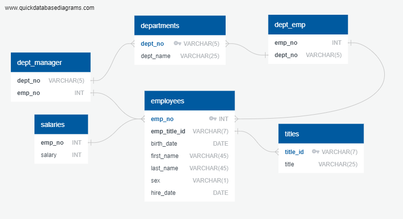
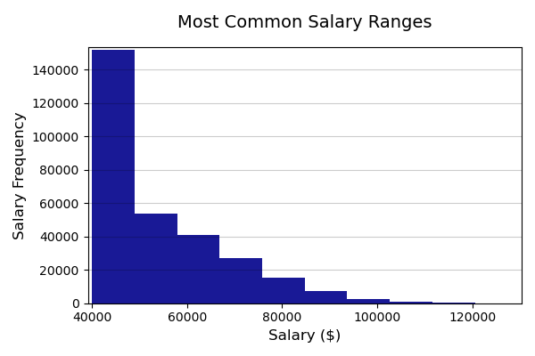
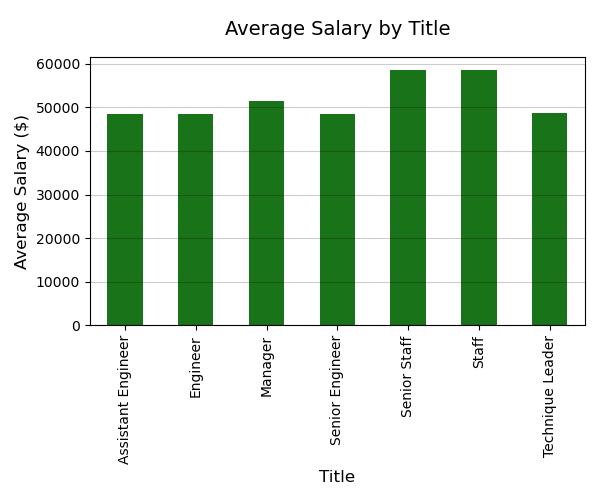

# SQL Homework - Employee Database: A Mystery in Two Parts

SQL Challenge steps, analysis and outputs

Create repository sql-challenge on GitHub
Clone the repository on the local computer  
Create folder EmployeeSQL 
Add data CSV files into a separate folder under EmployeeSQL

#### Data Modeling

Inspect the CSVs and create an ERD of the tables by using quickdatabasediagrams

#### Data Engineering

Create a table schema for each of the six CSV files including data types, primary keys, foreign keys, and any other required constraints.
Import each CSV file into the corresponding SQL table.

#### Data Analysis

Create an SQL file and analyse data to obtain the following information: 

Employees list 
Employees hired in 1986
List of managers for each department
List of departments for each employee
List of all employees that have first name "Hercules" and their last names begin with "B"
List of all employees in the Sales department
List of all employees in the Sales and Development departments
Frequency count of employee last names, in descending order

## Pandas Analysis

Create a Jupyter Notebook for Pandas analysis

Import the SQL database into Pandas

Create a histogram to visualize the most common salary ranges for employees.

Create a bar chart of average salary by title.

Review data to find out if employee ID number 499942 exists

